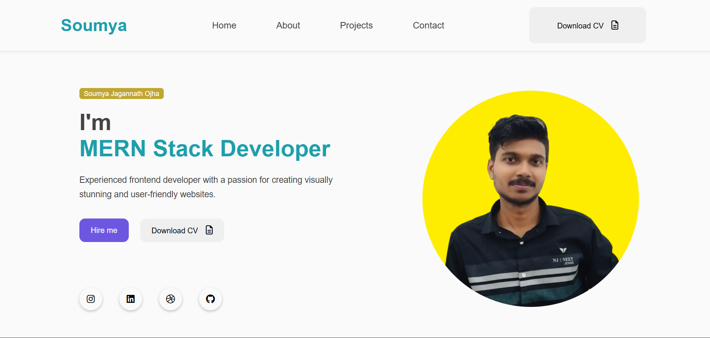
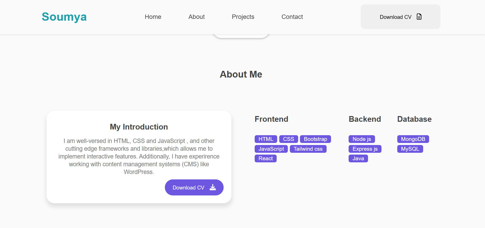
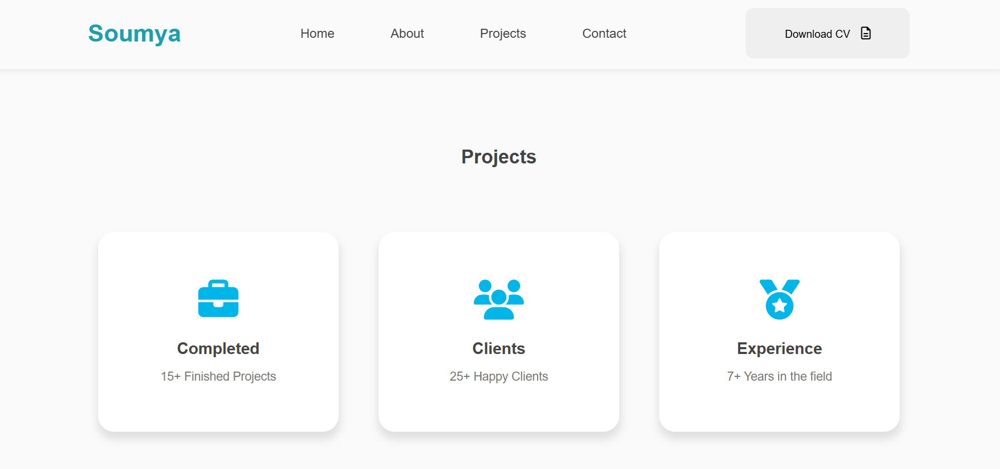
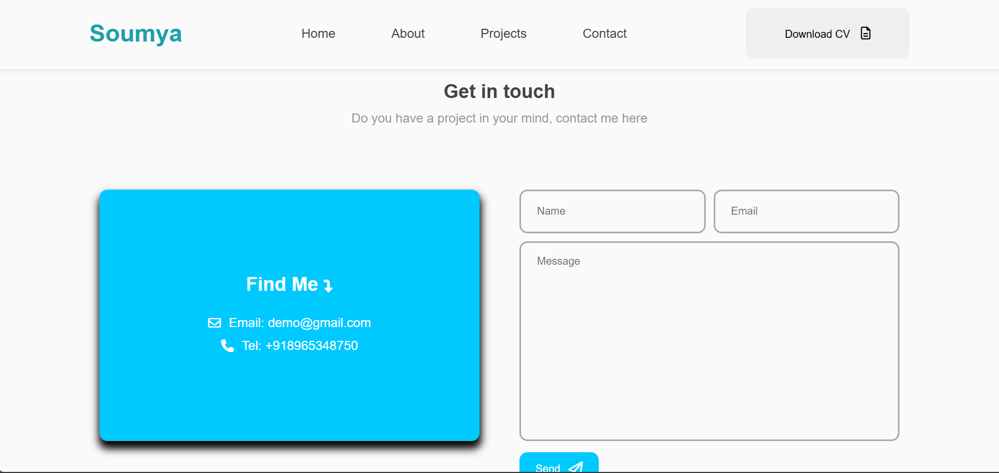
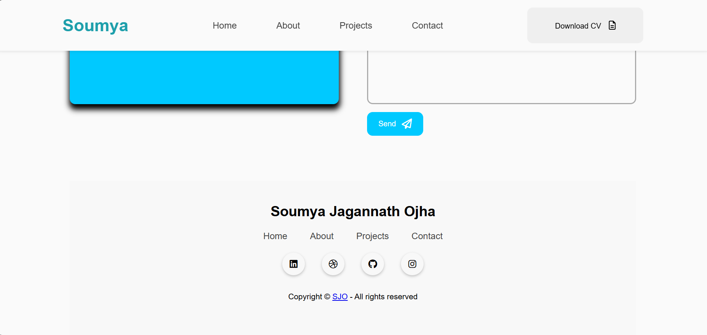

# 🌐 Personal Portfolio Website

This is a simple and responsive **Portfolio Website** built using **HTML** and **CSS**. It showcases personal details, projects, skills, and contact information — ideal for representing yourself online as a developer or designer.

---


## 🚀 Features

- Clean and professional UI
- Responsive design (mobile-friendly)
- Project showcase section
- About me section
- Contact information
- Social media links

---

## 💡 Technologies Used

- **HTML5** – Markup structure
- **CSS3** – Styling and layout


---

## 📸 Screenshots

### 🖥️ Home Page


### 🖥️ About Page


### 🖥️ Project Page


### 🖥️ Contact Page


### 🖥️ Footer


---

## 🛠️ How to Use

1. Clone the repository:
   ```bash
   git clone https://github.com/Soumya-Jagannath-Ojha/Frontend-Portfolio.git


